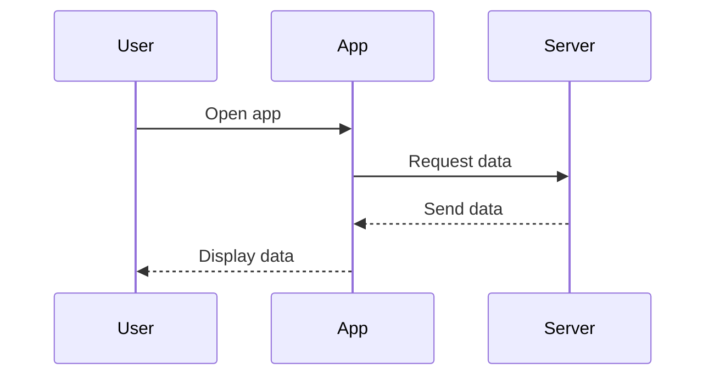
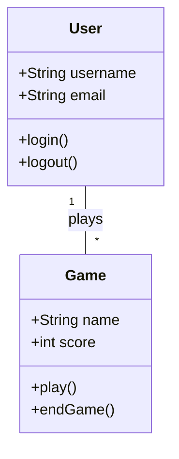

# Diagram as Code Guide for GrowEbuddy PSA

This guide outlines the tools and practices for creating diagrams as code in the GrowEbuddy PSA project.

## Mermaid

We use Mermaid for flowcharts and information architecture diagrams.

### Installation

Mermaid is a JavaScript-based diagramming tool. For local rendering, you can use the Mermaid CLI:

```bash
npm i mermaid 
npm install -g @mermaid-js/mermaid-cli
```
### Usage

Create Mermaid diagrams in Markdown files using the following syntax:

    ```mermaid
    graph TD
        A[Start] --> B{Is it?}
        B -->|Yes| C[OK]
        C --> D[Rethink]
        D --> B
        B ---->|No| E[End]
    ```

### Rendering

To render a Mermaid diagram to an image:

```bash
mmdc -i input.mmd -o output.png
mmdc -i input.mmd -o output.svg
```
### Integration with IDEs

- VS Code: Install the "Mermaid Preview" extension for live previews.
- PyCharm: Use the "Mermaid" plugin for diagram rendering.

## Python for UI Design

We use Python with drawing libraries for wireframes and UI components, and UI frameworks for interactive prototypes.

### Installation

Install the required Python libraries:

```bash
pip install pillow PyQt5 kivy
```

### Usage

Create Python scripts to generate UI elements. Example:

```python
from PIL import Image, ImageDraw

def create_button(text, width, height):
    img = Image.new('RGB', (width, height), color='white')
    d = ImageDraw.Draw(img)
    d.rectangle([0, 0, width-1, height-1], outline='black')
    d.text((10, 10), text, fill='black')
    return img

button = create_button('Click me', 100, 40)
button.save('button.png')
# Add these lines to display the image
button.show()
```

### Rendering

Run the Python scripts to generate the UI elements or prototypes.

### Version Control

- Commit both the Python scripts and the generated images to the repository.
- Use meaningful commit messages describing the changes made to the diagrams.

## Git Workflow for Diagram Changes

1. Create a new branch for your diagram changes: `git checkout -b diagram/feature-name`
2. Make your changes to the diagram code
3. Commit your changes with a descriptive message: `git commit -m "Add user flow diagram for registration process"`
4. Push your branch to the remote repository: `git push origin diagram/feature-name`
5. Create a pull request for review
6. After approval, merge the changes into the main branch

## Additional Diagram Examples

### Sequence Diagram (Mermaid)



### Class Diagram (Mermaid)



## Code Organization for Complex Diagrams

For complex diagrams, organize your Python code as follows:

1. Create a separate module for each major diagram type (e.g., `wireframes.py`, `mockups.py`)
2. Use classes to represent different components or screens
3. Implement a main function that generates all diagrams when the script is run

Example structure:

```python
# wireframes.py
class BaseScreen:
    # Common functionality

class LoginScreen(BaseScreen):
    # Login screen specific code

class DashboardScreen(BaseScreen):
    # Dashboard screen specific code

def generate_wireframes():
    # Generate all wireframes

if __name__ == "__main__":
    generate_wireframes()
```

## Troubleshooting

### Common Issues and Solutions

1. Mermaid syntax errors:
   - Double-check your syntax against the Mermaid documentation
   - Use a Mermaid live editor to debug your code

2. Python rendering issues:
   - Ensure all required libraries are installed and up to date
   - Check for proper file paths when saving or loading images

3. Git conflicts with diagram files:
   - Always pull the latest changes before starting work on a diagram
   - If conflicts occur, manually merge the changes and regenerate the diagram

For any persistent issues, consult the project's technical lead or open an issue in the repository.

## Best Practices

1. Store all diagram code in the repository under the `docs/design/diagrams/` directory.
2. Use clear and descriptive names for files and functions.
3. Comment your code to explain complex parts of the diagrams.
4. Update diagrams when making changes to the application structure or flow.
5. Review generated diagrams for clarity and accuracy before committing.
6. Use consistent styling and color schemes across all diagrams.
7. Optimize images for web viewing (compress PNGs, use SVGs where possible).
8. Include a legend or key for complex diagrams.

## Collaboration

- Use pull requests for reviewing and merging diagram changes.
- Provide constructive feedback on diagram designs during code reviews.
- Regularly update the team on significant diagram changes during stand-ups.

## Resources

- [Mermaid Documentation](https://mermaid-js.github.io/mermaid/#/)
- [Pillow Documentation](https://pillow.readthedocs.io/en/stable/)
- [PyQt5 Documentation](https://www.riverbankcomputing.com/static/Docs/PyQt5/)
- [Kivy Documentation](https://kivy.org/doc/stable/)

Remember to refer to the DIAGRAM_STANDARDS.md file for project-specific standards and conventions when creating diagrams.
