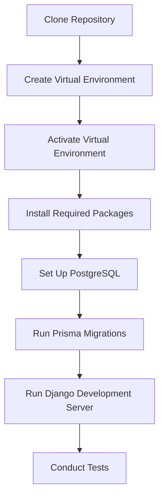
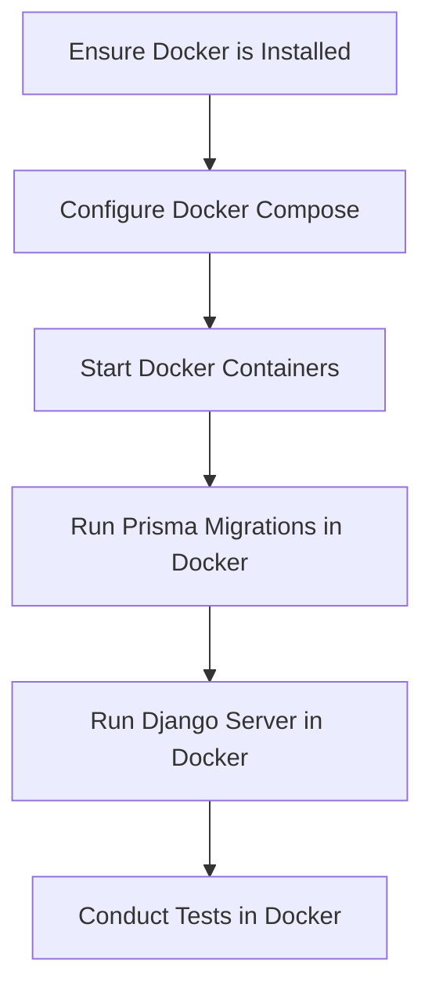
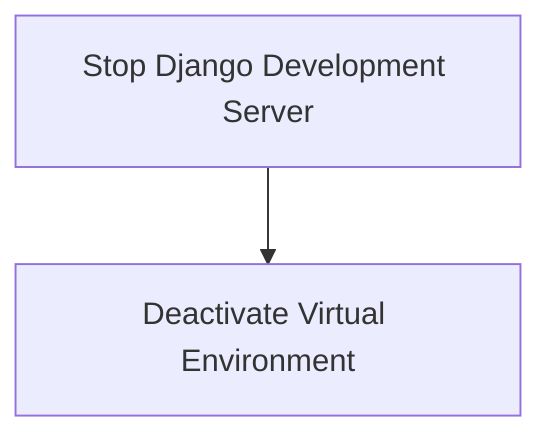
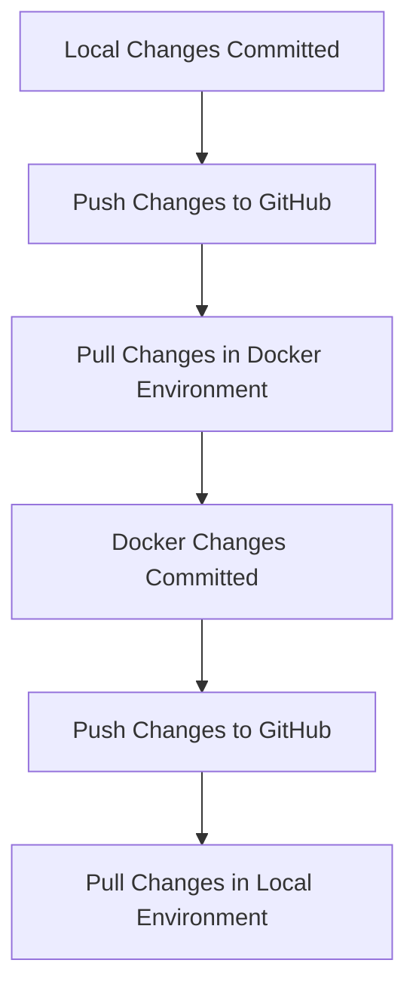

# Comprehensive Workflow Guide for GrowEbuddy_PSA

## Overview
This guide outlines the workflow for setting up the GrowEbuddy_PSA project based on the environment being used. It includes instructions for local and Docker setups, as well as best practices for testing and documentation.

---

## Prerequisites

### Local Environment Prerequisites
- **Python** (version 3.8 or higher): Required for running the backend.
- **PostgreSQL** (version 12 or higher): Required for the database.
- **Node.js**: Required for frontend development.
- **pip**: Python package installer for managing dependencies.

### Docker Environment Prerequisites
- **Docker**: Ensure Docker Desktop is installed and running on your machine.
- **Docker Compose**: Comes with Docker Desktop, used for managing multi-container Docker applications.

---

## Local Environment Setup

### Steps to Set Up Locally
1. **Clone the Repository**:
   ```bash
   # Clone the repository from GitHub to your local machine
   git clone https://github.com/yaguarnecro/Growgrebuddy_PSA
   # Change directory to the cloned repository
   cd Growgrebuddy_PSA
   ```

2. **Create and Activate a Virtual Environment**:
   ```bash
   # Navigate to the src directory where the virtual environment will be created
   cd src
   # Create a virtual environment named 'venv'
   python -m venv venv
   # Activate the virtual environment (Windows)
   .\venv\Scripts\activate
   ```

3. **Install Required Packages**:
   ```bash
   # Install the required Python packages from requirements.txt
   pip install -r requirements.txt
   ```

4. **Set Up PostgreSQL**:
   - **Create a New PostgreSQL Database**:
     ```sql
     -- Create a new database for the project
     CREATE DATABASE GrowEbuddy_PSA_DB;
     ```
   - **Create a New User and Grant Privileges**:
     ```sql
     -- Create a new user with a password
     CREATE USER your_user WITH PASSWORD 'your_password';
     -- Grant all privileges on the new database to the user
     GRANT ALL PRIVILEGES ON DATABASE GrowEbuddy_PSA_DB TO your_user;
     ```

5. **Run Prisma Migrations**:
   ```bash
   # Navigate to the backend/prisma directory to run migrations
   cd backend/prisma
   # Run Prisma migrations to set up the database schema
   npx prisma migrate dev --name init
   # Generate Prisma client
   npx prisma generate
   ```

6. **Run the Django Development Server**:
   ```bash
   # Navigate back to the root directory of the project
   cd ../..
   # Start the Django development server
   python manage.py runserver
   ```

### Testing in Local Environment
- Conduct unit tests and integration tests to ensure functionality.
- Use the following command to run tests:
   ```bash
   # Run all tests defined in the Django application
   python manage.py test
   ```

---

## Shutting Down Local Environment
To safely shut down the local environment:
1. **Stop the Django Development Server**:
   - In the terminal where the server is running, press `Ctrl + C` to stop the server.
   ```bash
   # This command stops the Django development server
   ```

2. **Deactivate the Virtual Environment**:
   ```bash
   # Deactivate the virtual environment when done
   deactivate
   ```

---

## Docker Environment Setup

### Steps to Set Up with Docker
1. **Ensure Docker is Installed**.
2. **Configure Docker Compose**:
   - Update the `docker-compose.yml` file as needed.

3. **Start Docker Containers**:
   ```bash
   # Start all services defined in the docker-compose.yml file
   docker-compose up -d
   ```

4. **Run Prisma Migrations in Docker**:
   ```bash
   # Execute the Prisma migration command inside the backend container
   docker-compose exec backend npx prisma migrate dev --name init
   ```

5. **Run the Django Server in Docker**:
   ```bash
   # Start the Django server inside the backend container
   docker-compose exec backend python manage.py runserver 0.0.0.0:8000
   ```

### Testing in Docker Environment
- Run tests within the Docker container:
   ```bash
   docker-compose exec backend python manage.py test
   ```

---

## Shutting Down Docker Environment
To safely shut down the Docker environment:
1. **Stop and Remove All Running Containers**:
   ```bash
   # This command stops all services defined in the docker-compose.yml file and removes the containers
   docker-compose down
   ```

2. **Remove Unused Docker Images (Optional)**:
   ```bash
   # This command removes all unused images to free up space
   docker image prune -a
   ```

---

## Visual Aids

### Local Environment Setup Flowchart


### Docker Environment Setup Flowchart


### Shutting Down Local Environment Flowchart


### Shutting Down Docker Environment Flowchart
```mermaid
graph TD;
    A[Stop and Remove All Running Containers] --> B[Remove Unused Docker Images (Optional)];
```

### Workflow for Changes Between Environments Flowchart


---

## Workflow for Changes from One Environment to Another

### From Local to Docker
1. **Ensure Local Changes Are Committed**:
   ```bash
   # Check the status of your changes
   git status
   # Add and commit changes
   git add .
   git commit -m "Your commit message"
   ```

2. **Push Changes to GitHub**:
   ```bash
   # Push your changes to the remote repository
   git push origin <branch_name>
   ```

3. **Pull Changes in Docker Environment**:
   ```bash
   # Navigate to the Docker directory and pull the latest changes
   docker-compose exec backend git pull origin <branch_name>
   ```

### From Docker to Local
1. **Ensure Changes in Docker Are Committed**:
   ```bash
   # Check the status of your changes in the Docker container
   docker-compose exec backend git status
   # Add and commit changes
   docker-compose exec backend git add .
   docker-compose exec backend git commit -m "Your commit message"
   ```

2. **Push Changes to GitHub**:
   ```bash
   # Push your changes from the Docker container to the remote repository
   docker-compose exec backend git push origin <branch_name>
   ```

3. **Pull Changes in Local Environment**:
   ```bash
   # Pull the latest changes in your local repository
   git pull origin <branch_name>
   ```

---

## Best Practices for Documentation and Repository Management
- **Use Descriptive Commit Messages**: Clearly describe what changes were made in each commit.
- **Regularly Pull Changes**: Always pull the latest changes from the remote repository before starting new work.
   ```bash
   git pull origin <branch_name>
   ```

- **Branching Strategy**: Use feature branches for new features or bug fixes.
   ```bash
   git checkout -b feature/your-feature-name
   ```

---

## Conclusion
This guide provides a comprehensive overview of setting up, shutting down, and managing the workflow for the GrowEbuddy_PSA project in both local and Docker environments. By following these steps, developers can ensure a smooth development process and maintain high standards for testing and documentation.